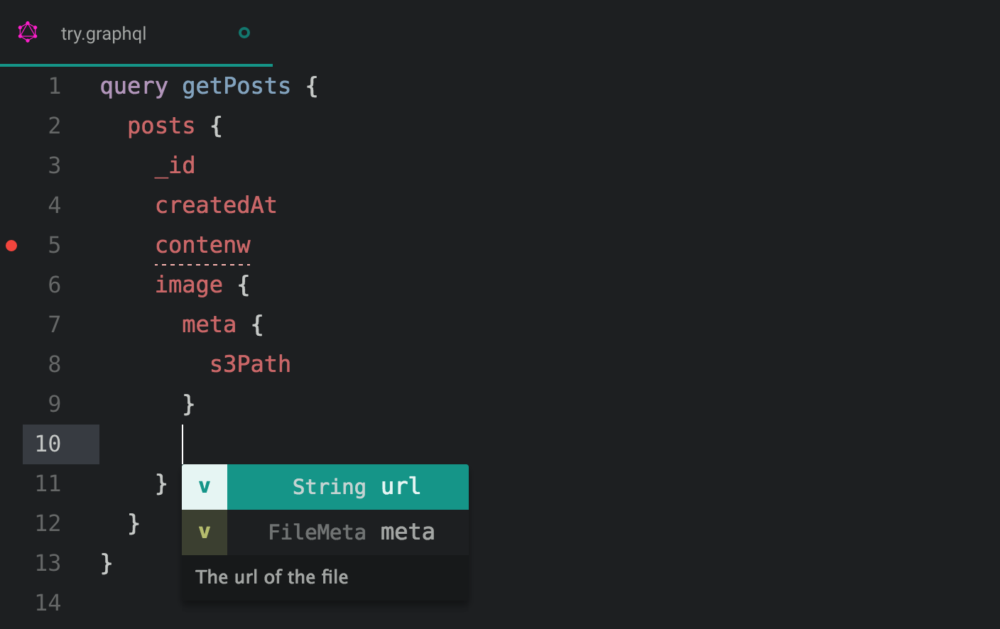

# GraphQL Autocomplete Atom

```sh
graphql-autocomplete
```

Autocomplete and lint from a GraphQL endpoint in atom.



### Instructions

- Create a ```.gqlautocompleterc``` file in the root of your project

- Add the ```endpoint```:

```json
{
  "endpoint": "http://localhost:3000/graphql"
}
```
